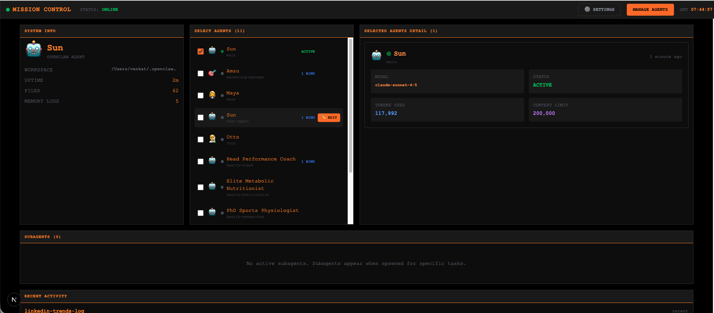
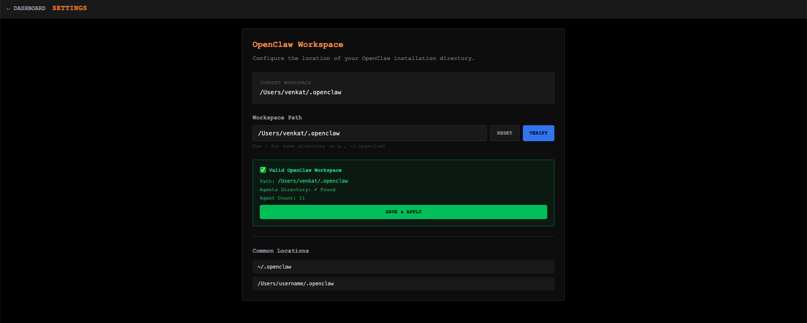
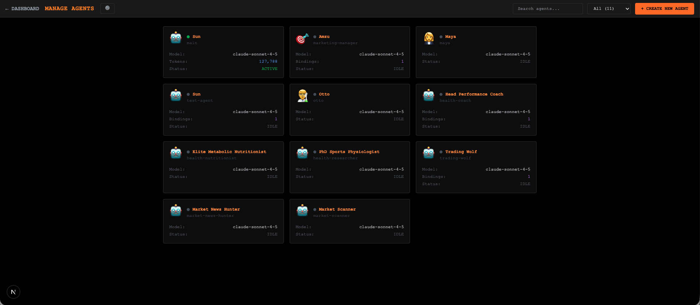
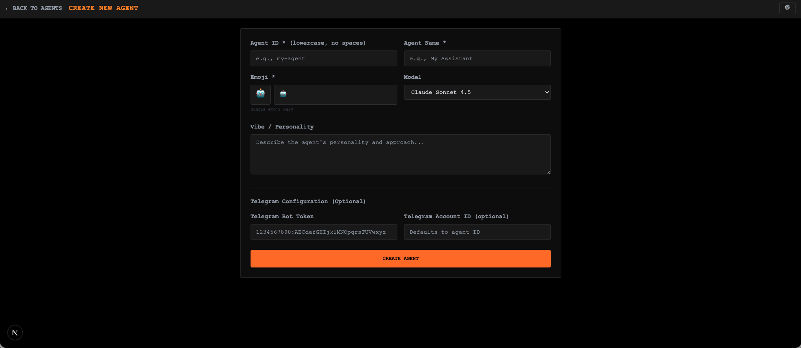
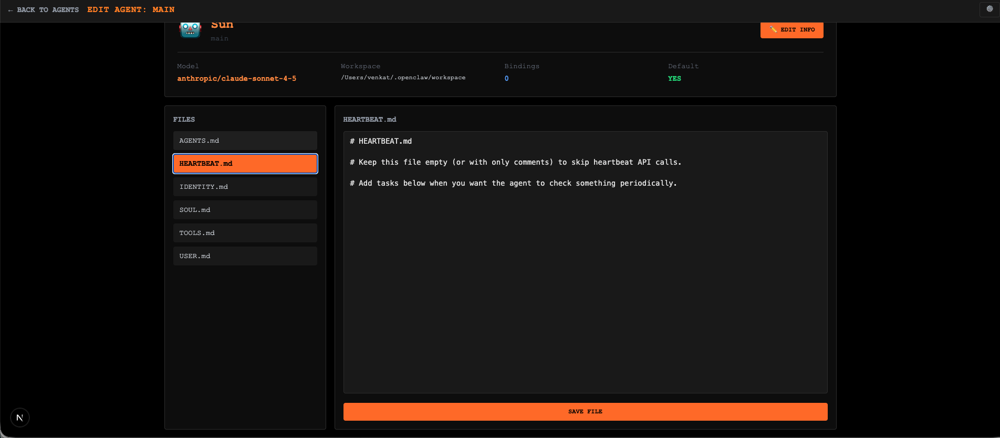

# Mission Control 🚀

A beautiful, Bloomberg Terminal-inspired dashboard for managing and monitoring your **OpenClaw AI agents**. Built with Next.js 14, TypeScript, and Tailwind CSS.



## ✨ Features

### 🎯 **Agent Management**
- **View all agents** with real-time status
- **Create new agents** with custom emojis and models
- **Edit agent configurations** (name, emoji, model selection)
- **Edit agent files** (IDENTITY.md, SOUL.md, USER.md, etc.)
- **Search and filter** agents by name or status
- **Telegram & Discord integration** during creation (add bot tokens)



### 📊 **Real-time Monitoring**
- **Dashboard overview** with agent statistics
- **Subagent tracking** with activity logs
- **Token usage** and context limits
- **Active/Idle status** indicators
- **Auto-refresh** every 10 seconds



### 🛠️ **Configuration**
- **Workspace path selection** with verification
- **Model selection** (Claude Sonnet, Opus, GPT-4, etc.)
- **Discord bot integration** setup with full config
- **Telegram bot integration** setup
- **Emoji picker** with 70+ options across 7 categories



### 🎨 **Bloomberg Terminal Aesthetic**
- **Dark theme** with orange accents
- **Monospace fonts** and clean layout
- **Native dialogs** (no browser popups)
- **Smooth animations** and transitions



---

## 🚀 Quick Start

### Prerequisites

Before you begin, ensure you have:

1. **Node.js 18+** installed
   ```bash
   node --version  # Should be 18.0.0 or higher
   ```

2. **OpenClaw** installed and configured
   ```bash
   openclaw --version
   ```

3. **OpenClaw workspace** (default: `~/.openclaw`)
   ```bash
   ls ~/.openclaw
   ```

### Installation

1. **Clone the repository**
   ```bash
   git clone https://github.com/amzu-dev/mission-control.git
   cd mission-control
   ```

2. **Install dependencies**
   ```bash
   npm install
   ```

3. **Start the development server**
   ```bash
   npm run dev
   ```

4. **Open your browser**
   ```
   http://localhost:3002
   ```

That's it! 🎉

---

## 📖 First-time Setup

### If you see the setup screen:

Mission Control will automatically detect if your OpenClaw workspace is configured.

1. **Enter your workspace path** (default: `~/.openclaw`)
2. Click **"VERIFY WORKSPACE"**
3. If valid, click **"SAVE & CONTINUE"**
4. Dashboard will load with your agents!

### Common workspace paths:
- `~/.openclaw` (default)
- `/Users/username/.openclaw`
- `/opt/openclaw`

---

## 🎯 Usage Guide

### Dashboard (`/`)

The main dashboard shows:
- **System Info** - Agent name, emoji, uptime, files
- **Select Agents** - Choose which agents to monitor
- **Selected Agent Details** - Model, tokens, status, bindings
- **Subagents** - Active subagent sessions with logs
- **Recent Activity** - Latest memory logs

**Quick Actions:**
- Hover over agents → Click **"✏️ EDIT"** to edit directly
- Click **"⚙️ SETTINGS"** to configure workspace
- Click **"MANAGE AGENTS"** for full agent list

---

### Manage Agents (`/manage`)

Grid view of all your agents with:
- Agent name, emoji, and ID
- Model being used
- Token usage
- Active/Idle status
- Number of bindings

**Search & Filter:**
- Use the search bar to find agents by name/ID
- Filter by status: All, Active, or Idle
- Click any agent card to edit
- Hover over agent cards to reveal **delete button** (🗑️) in top-right corner
  - Quick delete without entering edit page
  - Same safety checks and confirmation dialog

---

### Create Agent (`/manage/create`)

1. **Fill in required fields:**
   - Agent ID (lowercase, no spaces)
   - Agent Name
   - Emoji (use picker or type)

2. **Optional fields:**
   - Vibe/Personality description
   - Model selection
   - **Telegram Bot Token** (for Telegram integration)
   - **Discord Bot Token** (for Discord integration)

3. Click **"CREATE AGENT"**
4. Success! You'll be redirected to manage page

**Integration Setup:**
- **Telegram:** Add bot token from @BotFather
- **Discord:** Add bot token from [Discord Developer Portal](https://discord.com/developers/applications)
  - Requires Message Content Intent enabled
  - Bot will auto-configure with pairing policy

---

### Edit Agent (`/manage/edit/{agentId}`)

#### Agent Info Section:
Click **"✏️ EDIT INFO"** to modify:
- **Name** - Change agent's display name
- **Emoji** - Pick a new emoji
- **Model** - Select AI model (Claude, GPT-4, etc.)

#### Files Section:
- View all core agent files (IDENTITY.md, SOUL.md, etc.)
- Click a file to edit
- Edit in raw text editor
- Click **"SAVE FILE"** to persist changes

#### Delete Agent:
Click **"🗑️ DELETE"** button (top right, next to EDIT INFO) to safely delete an agent:
- **Safety check**: Main agent cannot be deleted
- **Confirmation dialog** before deletion
- **Permanent action**: Removes all agent files and configuration
- Uses OpenClaw's `openclaw agents delete` command
- Redirects to manage page after deletion

---

### Settings (`/settings`)

Configure your OpenClaw workspace:

1. **Enter workspace path**
2. Click **"VERIFY"** to check validity
3. View verification results:
   - Path status
   - Agent count
   - Agents directory found
4. Click **"SAVE & APPLY"**
5. Page reloads with new workspace

### Integrations

Access platform integrations from Settings:
- **Discord** - Bot integration setup
- **Telegram** - Bot integration setup

---

### Discord Integration (`/discord`)

Complete Discord bot setup in one place:

#### Setup Steps:
1. **Create Discord Application**
   - Go to [Discord Developer Portal](https://discord.com/developers/applications)
   - Create New Application → Add Bot
   - Enable **Message Content Intent** and **Server Members Intent**
   - Copy Bot Token

2. **Configure in Mission Control**
   - Enter Bot Token
   - Add Server ID (Guild ID) - Right-click server → Copy ID
   - Add Your User ID - Right-click avatar → Copy ID
   - Enable Discord Integration

3. **Access Policies**
   - **DM Policy**: pairing | allowlist | open | disabled
   - **Group Policy**: allowlist | open | disabled
   - **Require @mention**: Toggle for server channels

4. **Features**
   - **Streaming Mode**: off | partial | block | progress
   - **History Limit**: 0-100 messages in context

5. **Save & Activate**
   - Click "SAVE DISCORD CONFIGURATION"
   - Gateway restarts automatically
   - Approve pairing in Discord DMs!

---

## 🔧 Configuration

### Environment Variables

Mission Control works out of the box, but you can customize:

```bash
# .env.local (optional)
PORT=3002                           # Change port (default: 3002)
OPENCLAW_WORKSPACE=~/.openclaw      # Default workspace path
```

### Available Models

When creating/editing agents, choose from:
- **Claude Sonnet 4.5** (default)
- **Claude Opus 4.5**
- **Claude Opus 4.6**
- **Claude Sonnet 3.5**
- **GPT-4**
- **GPT-4 Turbo**
- **GPT-3.5 Turbo**

### Telegram Integration

To enable Telegram for an agent:

1. Create bot with [@BotFather](https://t.me/BotFather)
2. Copy the bot token (format: `1234567890:ABC...`)
3. Paste in **"Telegram Bot Token"** field when creating agent
4. OpenClaw will automatically route messages to that agent

---

## 🐛 Troubleshooting

### "No agents found" on startup

**Solution:** Configure your workspace path in Settings
1. Click ⚙️ Settings
2. Enter your OpenClaw workspace path
3. Verify and save

### Agents not showing up

**Check:**
```bash
# Verify OpenClaw is installed
openclaw --version

# List agents via CLI
openclaw agents list

# Check workspace exists
ls -la ~/.openclaw/agents
```

### Port 3002 already in use

**Change the port:**
```bash
# Kill existing process
lsof -ti:3002 | xargs kill

# Or run on different port
PORT=3003 npm run dev
```

### Changes not saving

**Verify permissions:**
```bash
# Check workspace is writable
ls -la ~/.openclaw

# If needed, fix permissions
chmod -R u+w ~/.openclaw/workspace
```

---

## 🏗️ Tech Stack

- **Next.js 14** - React framework with App Router
- **TypeScript** - Type safety
- **Tailwind CSS** - Utility-first styling
- **date-fns** - Date formatting
- **OpenClaw CLI** - Agent management

### Project Structure

```
mission-control/
├── app/
│   ├── components/        # Reusable components
│   │   ├── AgentManager.tsx
│   │   ├── Dialog.tsx
│   │   ├── EmojiPicker.tsx
│   │   └── SetupScreen.tsx
│   ├── lib/              # Utilities
│   │   └── workspace.ts
│   ├── manage/           # Agent management pages
│   │   ├── page.tsx
│   │   ├── create/
│   │   └── edit/[agentId]/
│   ├── settings/         # Settings page
│   ├── api/              # API routes
│   │   ├── all-agents/
│   │   ├── agent-files/
│   │   ├── agent-info/
│   │   ├── create-agent/
│   │   ├── save-file/
│   │   ├── status/
│   │   ├── subagents/
│   │   ├── update-agent/
│   │   └── verify-workspace/
│   ├── globals.css       # Global styles
│   ├── layout.tsx
│   └── page.tsx          # Main dashboard
├── public/
├── screenshots/          # Documentation images
├── package.json
└── README.md
```

---

## 🤝 Contributing

Contributions are welcome! Feel free to:
- Report bugs
- Suggest features
- Submit pull requests
- Improve documentation

---

## 📄 License

MIT License - feel free to use this project however you'd like!

---

## 🙏 Credits

Built for the **OpenClaw** community by developers who love beautiful, functional dashboards.

Inspired by Bloomberg Terminal's iconic interface.

